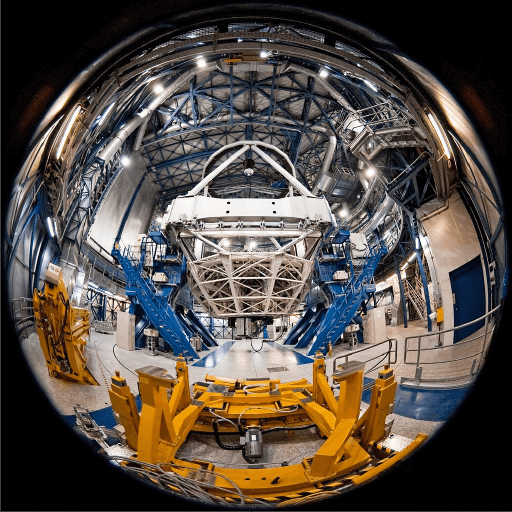

Converts a fish eye image to rect.

This conversion assumes that pixels are mapped equally by angles from the camera direction axis.

source downloaded from [this page](https://www.eso.org/public/images/potw1049a/)


result


# WebAssembly implementation
This repo has two implementations, one is pure TypeScript and another is WASM. The benchmark in the case of 100 times conversion is like the below. Surprizingly, TypeScript is mush faster than WASM. This can be because the conversion algorithm is pretty much simple so the overhead of exections in WASM can be larger (e.g. loading memory in WASM).

```
TypeScript: Finised in 1181 ms
WASM: Finised in 2041 ms
```
